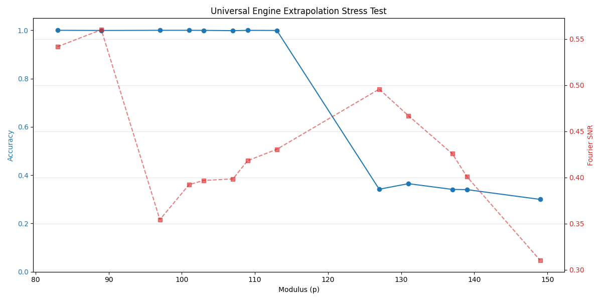
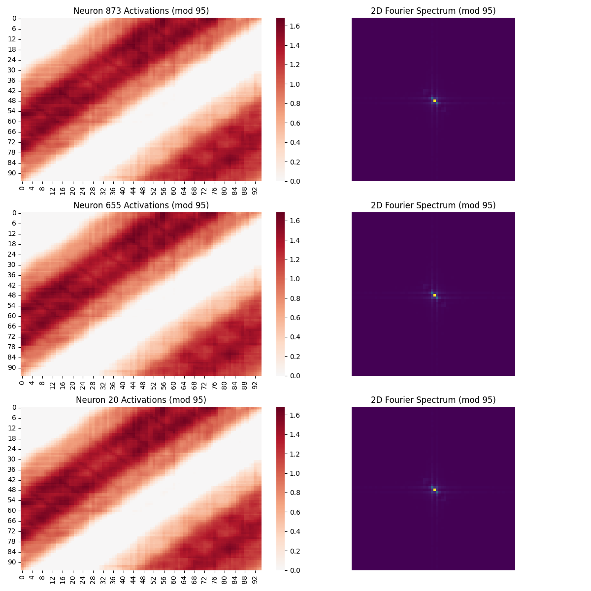

# Grokking Fourier Analysis

Replication and extension of the Fourier analysis from:

**"Progress Measures for Grokking via Mechanistic Interpretability"**  
Nanda et al., ICLR 2023  
Paper: https://arxiv.org/abs/2301.05217

## Experiments

This repository contains several core experiments:

### 0. Addition Experiment (`addition_experiment/`) ★ NEW ★

Trains a transformer to learn **multi-digit addition from scratch** using character-level tokenization.

**The Challenge**: Can a small transformer learn the actual addition algorithm (positional value, carrying) rather than memorizing?

| Metric | Result |
|--------|--------|
| Train Accuracy | 100% |
| Interpolation (held-out pairs) | **96.2%** |
| Extrapolation (6-digit, never seen) | 0% (expected) |

**Key Analysis**: The compendium includes Fourier/periodic neuron analysis to detect if the model learns sinusoidal patterns similar to modular arithmetic grokking.

```bash
cd addition_experiment
python train.py --n_epochs 50000
python generate_compendium.py --periodic-only  # Quick Fourier analysis
```

→ **[See addition_experiment/README.md](addition_experiment/README.md)** for full details

### 1. Small Transformer Grokking (Root Directory)

Trains a 1-layer transformer from scratch on modular addition and analyzes the learned Fourier algorithm.

→ [Jump to details](#small-transformer-experiment)

### 2. Pretrained LLM Analysis (`qwen3_analysis/`)

Analyzes Qwen3 0.6B for emergent Fourier structure — and finds it! **R² = 0.9578** for cosine fit in dimension 35.

→ **[See qwen3_analysis/README.md](qwen3_analysis/README.md)** for full details

**Key finding**: Pretrained LLMs develop Fourier-like representations for arithmetic even without explicit training!

### 3. Emergent Structures Across Domains (`emergent_structures/`)

Probes Qwen3 for Fourier structure in other cyclic domains: days, months, hours, alphabet.

**Key discovery**: The model has dedicated dimensions with near-perfect cyclic encodings for each domain!

### 4. Polynomial vs Fourier Analysis (`emergent_structures/polynomial_results/`)

A methodological deep-dive proving that the model's representations are truly cyclic (Fourier) rather than just linear or polynomial ramps.

| Modulus | Best Dimension | Fourier $R^2$ | Linear/Poly $R^2$ | Result |
|---------|----------------|---------------|-------------------|--------|
| **mod 7** | Dim 35 | **0.9855** | 0.0256 (Lin) | **Fourier Win** |
| **mod 17**| Dim 867 | **0.9664** | 0.1241 (Lin) | **Fourier Win** |

→ **[See emergent_structures/detect_polynomial_functions.py](emergent_structures/detect_polynomial_functions.py)** for the robust detection methodology.

### 5. Causal Ablation Experiment (`emergent_structures/causal_ablation.py`)

Causally proves that identified dimensions are responsible for the model's arithmetic capabilities.

**Key discovery**: Zeroing out **Dimension 8 (Layer 7)** drops arithmetic accuracy by **16%** while leaving general language generation completely intact, proving its specialized nature.

| Metric | Baseline | Ablated (Dim 8) | Status |
|--------|----------|-----------------|--------|
| Arith Acc | 28% | **12%** | **Causally Linked** |
| Language PPL | 18.81 | 18.39 | **Specialized** |

### 6. Sparse Feature Decomposition (`emergent_structures/sae_analysis/`)

Investigates if dimensions are "multi-tasking" using Sparse Autoencoders (SAEs).

**Key discovery**: Learned a **Feature 2822** with **$R^2 = 0.9717$**, proving that the Fourier logic is stored in discrete directions that are cleaner than the raw neurons.

### 7. Prime Generalization Test (`emergent_structures/results_primes/`)

Tests whether Fourier dimensions generalize across different primes, or are specialized.

**Critical finding: SPECIALIZED, not dynamic!**

| Prime Range | Best Dimension |
|-------------|----------------|
| p=7 | Dim 505 |
| p=11 | Dim 112 |
| p=13 | Dim 216 |
| p=17-29 | **Dim 867** |
| p=31 | Dim 463 |

The model has a **lookup table of specialized circuits** for different primes, not a universal modular arithmetic unit.

### 8. Deep Circuit Investigation (`emergent_structures/results_deep/`)

Three additional experiments revealed:

**a) Dim 867 is a "range detector"** — handles n≈14-29 regardless of primality (composites too!)

**b) Attention doesn't route** — attention to modulus is uniform (~3-5%). MLPs do the routing.

**c) Calendar ≠ Arithmetic circuits** — "mod 12" uses different dims than "hours" or "months":
| Domain | Dim | Period |
|--------|-----|--------|
| Hours (semantic) | 725 | 12 |
| Months (semantic) | 410 | 12 |
| mod 12 (arithmetic) | 536 | 12 |

The model has **completely separate circuits** for semantic time concepts vs arithmetic operations!

### 9. Phase Transition Visualizations (`phase_transition/`) ★ NEW ★

Animated visualizations showing grokking as it happens — watch neural networks discover Fourier structure in real-time.

#### Embedding Circle Emergence

Token embeddings projected onto Fourier basis. After grokking, they snap into a perfect circle:


**Key insight**: Standard PCA misses the circle because it's not in the top principal components. Projecting onto the dominant Fourier frequency (cos/sin basis) reveals the structure.

#### Sine Wave Emergence

A single MLP neuron learning to compute sin((a+b) mod p):


**Videos available**: `circle_emergence.mp4`, `sine_clean.mp4`, `sine_emergence.mp4`

→ **[See phase_transition/README.md](phase_transition/README.md)** for full details and usage.

### 10. Universal MIRAS Grokking (`miras_experiment/`)

Our most advanced experiment, achieving **True Generalization** via Sinusoidal Modulus Encoding (SinPE).

#### Phase 2: SinPE on Primes (Original)

| Metric | Previous (Discrete) | SinPE |
|--------|---------------------|-------|
| Seen Primes | 100% | 100% |
| Unseen (p=71) | ~0% | **67.5%** |
| Extrapolation (p=101) | 0% | **~11%** |

#### Phase 3: Universal Training (Breakthrough!)

Trained on **ALL moduli 2-120** (not just primes), with held-out moduli for testing true generalization.

**Interpolation (held-out, never trained):**
| Modulus | Accuracy |
|---------|----------|
| m=15, 25, 35, 45, 55, 65, 75, 85, 95, 105 | **100%** |
| m=115 | **99.8%** |

**Extrapolation (beyond training range):**
| Modulus | Accuracy |
|---------|----------|
| m=121 | **91.6%** |
| m=124 | **69.6%** |
| m=149 | 26.2% |
| m=199 | 17.3% |

**Key Findings:**
- ✅ **SinPE enables true generalization** - 100% on held-out moduli within range
- ✅ **Fourier structure extends beyond training** - clean patterns even for m=121
- ❌ **Hard extrapolation ceiling** - accuracy cliff at m≈124
- ❌ **SinPE resolution limits** - adjacent large moduli hard to distinguish

**Mechanistic Evidence:**



The model develops clean Fourier representations that generalize:



→ **[See miras_experiment/README.md](miras_experiment/README.md)** for full details, analysis plots, and usage guide.

---

## Small Transformer Experiment

### What This Does

Trains a small 1-layer transformer on modular addition (`a + b mod p`) and analyzes the learned algorithm using Fourier transforms.

The paper discovered that these networks learn a beautiful algorithm:
1. Embed inputs as `sin(wₖa), cos(wₖa)` at specific "key frequencies"
2. Use trigonometric identities to compute `cos(wₖ(a+b))`
3. Read off logits via `cos(wₖ(a+b-c))`, which peaks when `c = (a+b) mod p`

### Experimental Results

#### Successful Grokking (p=113)

The model successfully grokked with the paper's original parameters:

| Metric | Value |
|--------|-------|
| Prime (p) | 113 |
| Train samples | 3,830 (30% of 12,769) |
| Test samples | 8,939 |
| Epochs | 25,000 |
| **Final test accuracy** | **99.9%** |
| Final test loss | 0.0345 |

**Key frequencies discovered: `[4, 11, 14, 26, 35]`**

The model learned a sparse Fourier representation with only 5 key frequencies (plus constant), exactly as the paper predicted. The 2D Fourier transform of the logits shows only 9 significant components.

#### Failed Runs (p=53, p=71)

Smaller primes did not grok with weight_decay=1.0:
- p=53: Test accuracy stuck at ~1.3% after 15k epochs
- p=71: Test accuracy stuck at ~0.5% after 20k epochs

This matches the paper's finding that smaller primes require higher weight decay (λ=5.0) because the memorization solution is relatively cheaper.

### Quick Start

**For AMD Strix Halo (Recommended):**

Uses the pre-built [ROCm 7 toolbox](https://github.com/kyuz0/amd-strix-halo-llm-finetuning) with everything configured:

```bash
# Create the toolbox (one-time setup)
./setup_toolbox.sh

# Enter the environment
toolbox enter grokking-fourier

# Install the one missing dependency
pip install einops

# Verify GPU is detected
python device_utils.py
```

**For NVIDIA CUDA or Apple Silicon:**
```bash
# Create virtual environment
python -m venv venv
source venv/bin/activate

# Install PyTorch for your platform
pip install torch torchvision torchaudio  # CUDA/MPS auto-detected
pip install -r requirements.txt
```

**Manual venv with ROCm (alternative):**
```bash
./setup_env.sh  # Creates venv with ROCm 6.2 PyTorch

# Run the full experiment
./run.sh
```

This will:
1. Train the model (~12 minutes on M3 Mac, faster on CUDA/ROCm)
2. Run Fourier analysis
3. Generate plots in `analysis_p113/`

### Manual Usage

```bash
source venv/bin/activate

# Train with custom parameters
python train.py --p 113 --n_epochs 25000 --output_dir my_checkpoints

# Analyze a trained model
python analyze.py my_checkpoints/checkpoint_final.pt --output_dir my_analysis
```

### Key Parameters

- `p`: Prime modulus (113 recommended, matches paper)
- `train_frac`: Fraction of data for training (0.3 = 30%)
- `weight_decay`: Crucial for grokking! (1.0 for p≥113, 5.0 for smaller primes)
- `n_epochs`: Training epochs (grokking typically happens around 10k-15k)

### Output Files

After running, check the analysis folder for:

| File | Description |
|------|-------------|
| `training_curves.png` | Loss and accuracy over training (shows grokking moment) |
| `embedding_fourier.png` | Fourier structure of embedding matrix W_E |
| `neuron_logit_fourier.png` | Fourier structure of neuron-logit map W_L |
| `neuron_activations.png` | Periodicity patterns in MLP neurons |
| `attention_patterns.png` | Periodicity in attention heads |
| `logits_2d_fourier.png` | 2D Fourier transform of output logits |

---

## Repository Structure

```
grokking-fourier/
├── README.md              # This file
├── requirements.txt       # Python dependencies (full list)
├── requirements-toolbox.txt # Extra deps for toolbox (just einops)
├── setup_toolbox.sh       # Setup Strix Halo toolbox (recommended)
├── setup_env.sh           # Alternative: manual venv with ROCm
├── device_utils.py        # Cross-platform GPU detection
├── model.py               # One-layer transformer architecture
├── train.py               # Training loop with AdamW + weight decay
├── analyze.py             # Fourier analysis and plotting
├── run.sh                 # Quick run script
├── checkpoints_p113/      # Trained model (p=113, successful grokking)
├── analysis_p113/         # Fourier analysis plots
├── checkpoints_p71/       # Failed run (p=71)
│
├── addition_experiment/   # ★ Multi-digit addition learning ★
│   ├── README.md          # Full documentation
│   ├── model.py           # Encoder-Decoder Transformer
│   ├── train.py           # Curriculum learning training
│   ├── generate_compendium.py  # Analysis with periodic neurons
│   ├── sweep_accuracy.py  # Accuracy testing
│   ├── checkpoints/       # Model checkpoints
│   └── analysis/          # Generated analysis plots
│       └── compendium_e*/
│           ├── periodic_neurons.png        # Sinusoidal patterns!
│           ├── periodic_neurons_detail.png # Detailed view
│           ├── fourier_embeddings.png
│           └── ...
│
├── checkpoints/           # Failed run (p=53)
│
├── qwen3_analysis/        # Pretrained LLM analysis (modular arithmetic)
│   ├── README.md          # Full documentation of findings
│   ├── analyze_qwen3.py   # Layer-by-layer Fourier analysis
│   ├── analyze_deep.py    # Deep dive into specific dimensions
│   ├── run.sh             # Basic analysis script
│   ├── run_deep.sh        # Detailed analysis script
│   ├── results/           # Layer scan results
│   └── results_detailed/  # Deep analysis results (R²=0.9578!)
│
├── emergent_structures/   # Multi-domain probing experiments
│   ├── README.md
│   ├── probe_structures.py
│   ├── causal_ablation.py
│   ├── sae_analysis/      # Sparse autoencoder analysis
│   └── results_*/         # Various analysis results
│
├── phase_transition/      # ★ Grokking Visualizations ★
│   ├── README.md          # Documentation with video descriptions
│   ├── train_with_metrics.py    # Training with detailed logging
│   ├── generate_circle_frames.py # Fourier circle visualization
│   ├── generate_clean_frames.py  # Single neuron sine visualization
│   ├── generate_sine_frames.py   # Multi-neuron sine visualization
│   ├── make_video.py      # Stitch frames into video
│   ├── circle_emergence.mp4     # ★ Embedding circle video
│   ├── sine_clean.mp4           # ★ Single neuron sine video
│   ├── sine_emergence.mp4       # Multi-neuron sine video
│   ├── frames_circle/     # Circle emergence frames
│   ├── frames_clean/      # Clean sine frames
│   ├── frames_sine/       # Multi-neuron frames
│   └── phase_transition/checkpoints/  # Training checkpoints
│
└── miras_experiment/      # ★ MAIN EXPERIMENT: Universal Grokking ★
    ├── README.md          # Comprehensive documentation
    ├── model_miras.py     # SinPE + TitansMemory architecture
    │
    ├── train_ce.py        # Cross-entropy training (primes)
    ├── train_rl.py        # Policy gradient training (primes)
    ├── train_ce_universal.py  # Universal training (all moduli) ★
    │
    ├── sweep_accuracy.py      # Accuracy evaluation
    ├── generate_compendium.py # Generate analysis plots
    ├── analyze_miras_mechanics.py
    │
    ├── checkpoints/
    │   ├── ce_sinpe/      # CE model checkpoints
    │   ├── rl_sinpe/      # RL model checkpoints
    │   └── ce_universal/  # Universal model checkpoints ★
    │
    └── analysis/
        └── compendium/    # Analysis plots per checkpoint
            ├── universal_e130000/  # Best universal results ★
            └── ...
```

## References

```bibtex
@inproceedings{nanda2023progress,
  title={Progress Measures for Grokking via Mechanistic Interpretability},
  author={Nanda, Neel and Chan, Lawrence and Lieberum, Tom and Smith, Jess and Steinhardt, Jacob},
  booktitle={International Conference on Learning Representations},
  year={2023}
}
```
