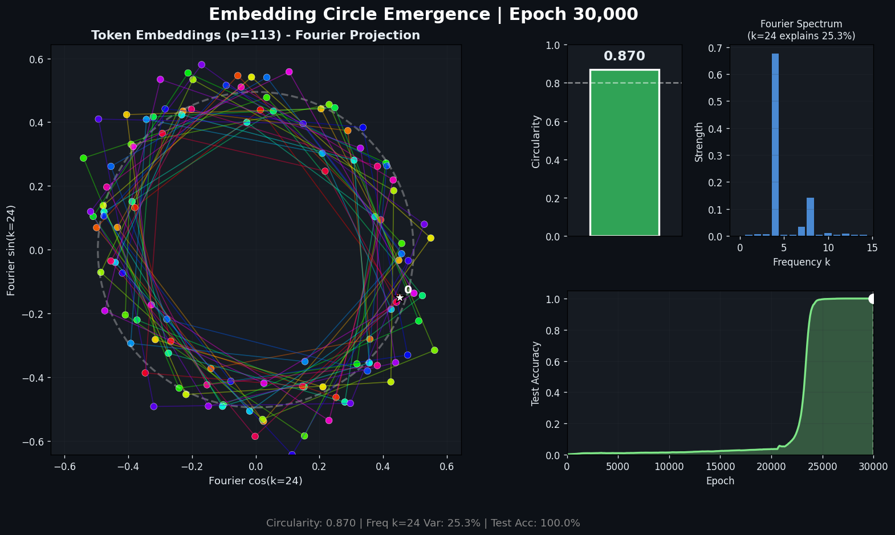
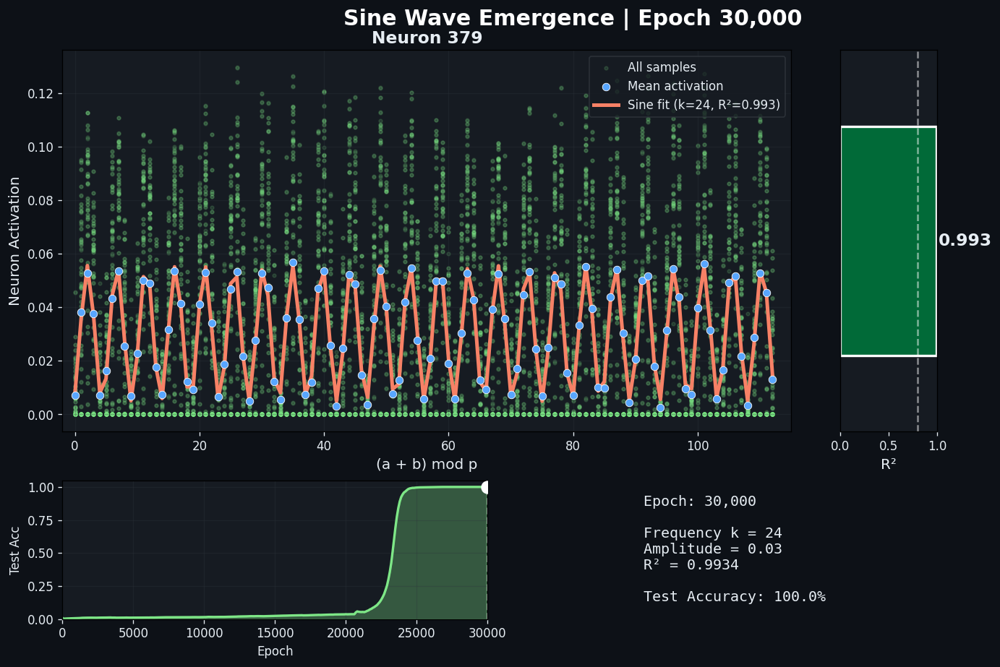

# Phase Transition Visualizations

Animated visualizations of grokking phase transitions in modular arithmetic learning.

## Videos

### 1. Embedding Circle Emergence (`circle_emergence.mp4`)

**"Grokking Visualized: Watch a Neural Network Discover the Circle"**

Shows token embeddings projected onto Fourier basis as training progresses. After grokking, embeddings arrange into a perfect circle because the network learns to represent numbers as (cos(2πkn/p), sin(2πkn/p)).



**What you see:**
- Left: Token embeddings projected onto dominant Fourier frequency (cos/sin basis)
- Top right: Circularity metric — how well points lie on a circle
- Middle right: Fourier spectrum — which frequency dominates
- Bottom right: Test accuracy — the sudden jump is "grokking"

### 2. Sine Wave Emergence (`sine_clean.mp4`)

**"One Neuron Learns a Sine Wave: Grokking in Action"**

Tracks a single MLP neuron's activation pattern vs (a+b) mod p. Before grokking: noise. After grokking: a clean sinusoid.



**What you see:**
- Blue dots: Mean activation for each value of (a+b) mod 113
- Green scatter: Individual activations (113 samples per sum)
- Orange line: Best-fit sine wave
- R² bar: How sinusoidal the neuron is (1.0 = perfect, 0.0 = random)

### 3. Full Sine Emergence (`sine_emergence.mp4`)

Shows 6 neurons simultaneously with their sine wave fits.

## Usage

```bash
# Train with frequent checkpoints and metrics
python train_with_metrics.py --n_epochs 30000 --checkpoint_every 1000

# Generate circle frames (Fourier projection)
python generate_circle_frames.py \
    phase_transition/checkpoints/default \
    phase_transition/checkpoints/default/history.json \
    --output_dir frames_circle/default

# Generate sine wave frames (single neuron)
python generate_clean_frames.py \
    phase_transition/checkpoints/default \
    phase_transition/checkpoints/default/history.json \
    --output_dir frames_clean/default

# Generate multi-neuron sine frames
python generate_sine_frames.py \
    phase_transition/checkpoints/default \
    phase_transition/checkpoints/default/history.json \
    --output_dir frames_sine/default

# Create videos with ffmpeg
ffmpeg -framerate 4 -i frames_circle/default/frame_%05d.png \
    -vf 'scale=trunc(iw/2)*2:trunc(ih/2)*2' -c:v mpeg4 -q:v 3 circle_emergence.mp4

ffmpeg -framerate 4 -i frames_clean/default/frame_%05d.png \
    -vf 'scale=trunc(iw/2)*2:trunc(ih/2)*2' -c:v mpeg4 -q:v 3 sine_clean.mp4
```

## Key Metrics Tracked

- `train_loss`, `test_loss`: Standard losses
- `train_acc`, `test_acc`: Accuracies
- `fourier_strength`: R² of best sin/cos fit to neuron activations
- `weight_norm`: Total L2 norm of parameters
- `embedding_circularity`: How circular the embedding geometry is (in Fourier basis)
- `key_frequencies`: Which Fourier frequencies are dominant

## Technical Details

### Circle Visualization

The key insight is that standard PCA often misses the circle structure because it may not lie in the top 2 principal components. Instead, we:

1. Compute Fourier basis vectors: cos(2πkn/p) and sin(2πkn/p) for each frequency k
2. Project embeddings onto this basis
3. Find the dominant frequency (highest variance)
4. Use that frequency's cos/sin as our 2D projection

This reveals the circle that PCA misses, with circularity scores jumping from ~0.5 to ~0.87 after grokking.

### Sine Visualization

Each MLP neuron learns to compute a sinusoidal function of the input sum. We:

1. Run all p² input pairs through the model
2. Group activations by (a+b) mod p
3. Fit sinusoids to find the best frequency k and measure R²
4. Track one neuron consistently across all frames (the one with best final R²)

## References

- "Grokking: Generalization Beyond Overfitting on Small Algorithmic Datasets" (Power et al., 2022)
- "A Mechanistic Interpretability Analysis of Grokking" (Nanda et al., 2023)
